# Proyecto-Reditos

## **Parte 1: Infraestructura como Código (IaC) con Terraform**

## Descripción

Este terraform crea una infraestructura en AWS que incluye una VPC con dos sub-redes: sub-red pública y privada, una instancias EC2 en la red pública, un grupo de seguridad para permitir tráfico HTT . La configuración está diseñada para proporcionar un entorno seguro y escalable.

### Componentes del Proyecto

1. **main.tf**
- **VPC**
   - **Descripción:** Crea una VPC con un bloque CIDR de `10.0.0.0/16` y un gateway de Internet.

-  **internet gateway**
    - **Descripción:** Crea un internet gateway para el acceso de la sub-red pública a internet

-  **Sub-redes**
   - **Descripción:** Crea dos sub-redes una públicas y una privada dentro de la VPC.

-   **Instancias EC2**
    - **Descripción:** Crea una instancias EC2 en la sub-red pública.

-   **Tablas de Rutas**
    - **Descripción:** Configura las tablas de rutas para la sub-rede pública y privada.

-   **Grupo de Seguridad**
    - **Descripción:** Crea un grupo de seguridad que permite tráfico SSH, HTTP y HTTPS.

-   **sub-red para la rds**
    - **Descripción:** Crea un grupo de sub-red para la RDS apuntando a la sub-red privada.

-   **Grupo de Seguridad RDS**
    - **Descripción:** Crea un grupo de seguridad que te da un ingress con el puerto 3306 para mysql y añadiendo el grupo de seguridad que apunta el EC2

-   **Grupo de Seguridad RDS**
    - **Descripción:** Crea la instancia RDS para este caso una mysql versión 8


2. **Variables**
   - **Descripción:** Define las variables necesarias para la configuración, como el nombre del key pair.

3. **Proveedor**
   - **Descripción:** Configura el proveedor de AWS y la región.

4. **terraform.tfvars**
    - **Descripción:** se configura el nombre del **KEY pair** para la conexión 

## Cómo Usarlo

### Requisitos Previos

1. **Terraform instalado:** Asegúrate de tener Terraform instalado en tu máquina.
2. **Credenciales de AWS:** Configura tus credenciales de AWS en `~/.aws/credentials`.
3. **Key Pair:** Crea un key pair en AWS.

### Archivo de Variables

Crea un archivo llamado `terraform.tfvars` en la raíz del proyecto y añade la siguiente línea para definir el nombre del key pair:

```hcl
key_pair_name = "nombre_de_tu_key_pair"
```

Asegúrate de reemplazar `"nombre_de_tu_key_pair"` con el nombre real de tu key pair.

### Inicialización del Proyecto

Para inicializar el proyecto y descargar los proveedores necesarios, ejecuta:

```bash
terraform init
```

### Planificación de la Infraestructura

Para ver un plan de la infraestructura que se creará, ejecuta:

```bash
terraform plan
```

### Aplicación de la Infraestructura

Para aplicar la configuración y crear la infraestructura en AWS, ejecuta:

```bash
terraform apply
```

### Destrucción de la Infraestructura

Para destruir la infraestructura creada, ejecuta:

```bash
terraform destroy
```

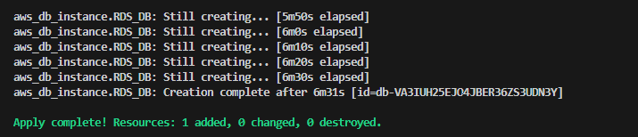

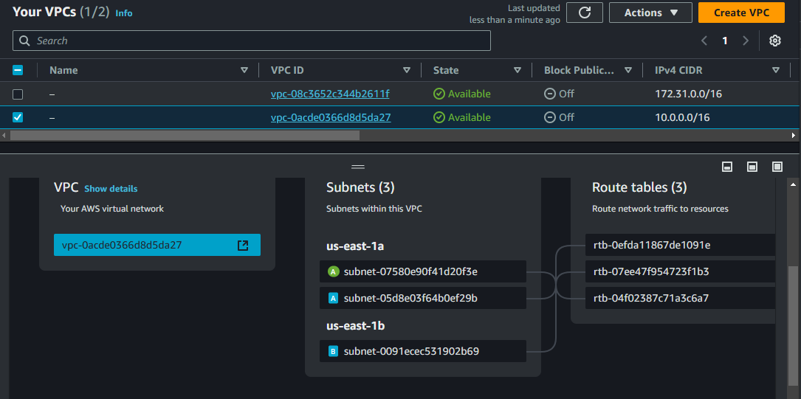

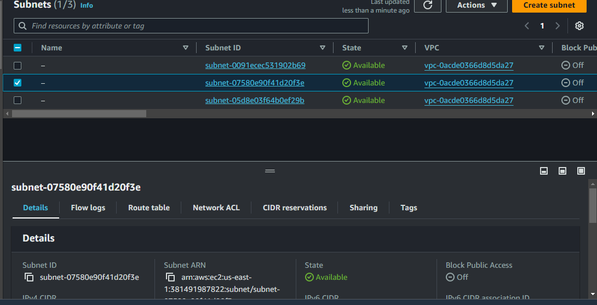

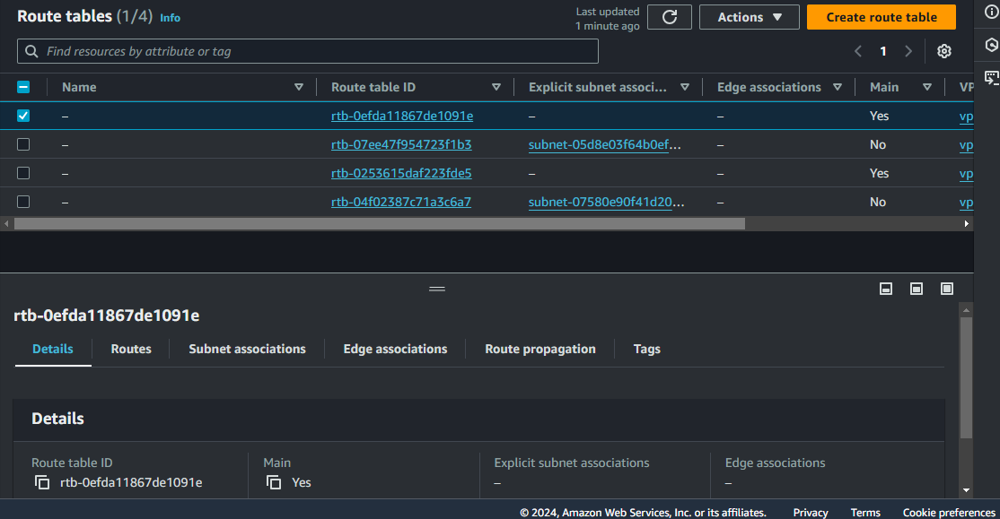

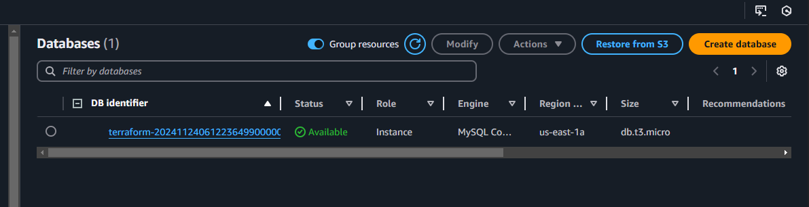


## **Parte 2: Automatización de Configuración con Ansible**

## Descripción 
Este apartado se automatiza la instalación de un nginx en una
instancia de EC2, adicionalmente se configura el nginx para servir una página web estática.

### Componentes 

#### **Site.yml**
En este archivo realizamos la configuración de EC2 y la instalación como tal del nginx, seguidamente se configura la web estática y se genera la ruta donde está el ejemplo de una página sencilla, a continuación se realizan las configuraciones del nginx las cuales les pasamos la ruta de los dos archivos de configuración nginx.conf.j2 y site.conf.j2

#### **inventory.init**

En este archivo realizamos como tal la conexión a la EC2 pasando por el hots de la EC2 creada, el user y por último el key pair descargado del paso anterior de terraform, para que ejecute correctamente hay que diligenciar correctamente los campos.

#### **all.yml**

En este archivo tenemos algunas variables que utilizaremos en los diferentes archivos de configuración 

### Procedimiento 

#### **Verificación de la instancia**

Ejecutamos el siguiente comando para comprobar el pin del hot de la EC2, desde donde se realiza la conexión en el archivo **inventory.init** 


```bash
ansible all -m ping
```

#### **Ejecución del playbook**

Ejecutamos el comando para ejecutar el playbook que nos va realizar las tareas que se encuentran en el archivos **Site.yml** y a la vez generando la conexión especificada del archivo **inventory.init**

```bash
ansible-playbook -i inventory.init site.yml
```
Y ya por último se realiza la consulta con el host de la EC2

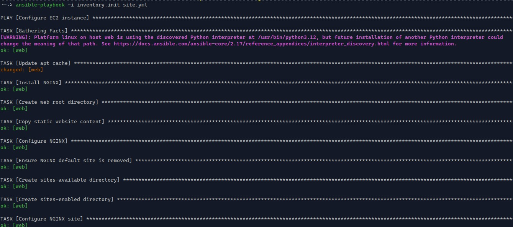

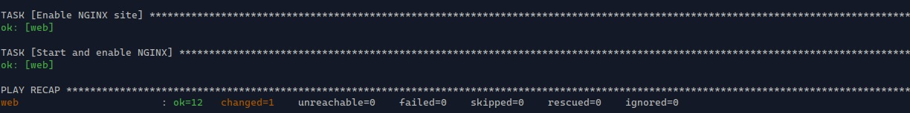

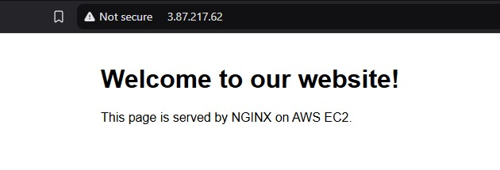


## Parte 3: Contenerización y Orquestación con Docker y Kubernetes

## Descripción 
Este apartado se va realizar la creación de una imagen basada en un desarrollo en go para mostrar en el localhost un "hellow, World" adicionalmente se generan dos archivos el deploy.yml para realizar el deploy de la app y el services para exponer la aplicación 


### Dockerfile
Dentro del Dockerfile vamos a correo con una imagen de go que va a estar expuesta por el 8080 

### main.go
Contiene el desarrollo pequeño que nos muestra un fron con el mensaje de "hellow, World"

## Procedimiento

Iniciamos con el build de la imagen, ejecutamos el siguiente comando con la versión 1.0

```bash
docker build -t hello-app:1.0 .
```
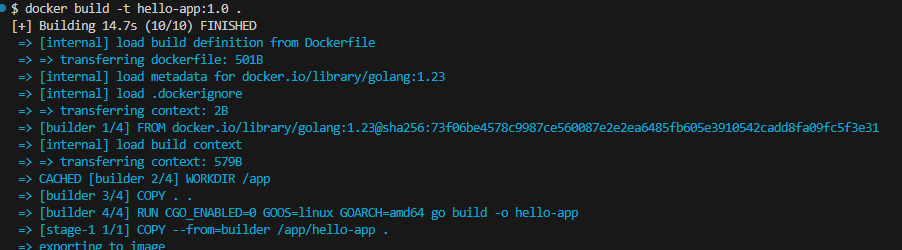

El segundo paso ejecutamos el docker run para ejecutar la aplicación por el puerto mencionado "8080"

```bash
docker run -p 8080:8080 hello-app:1.0
```
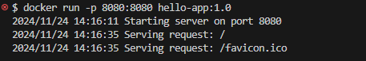

El tercer paso es realizar el docker login para subir la imagen a Dockerhub con el siguiente comando

```bash
docker login
```
Para el cuarto paso realizamos el tageo de la imagen para subirlo al docker hub

```bash
docker tag hello-app:1.0 b4sl/hello-app:1.0
```

Por último realizamos el push de la imagen al Dockerhub

```bash
docker push b4sl/hello-app:1.0
```
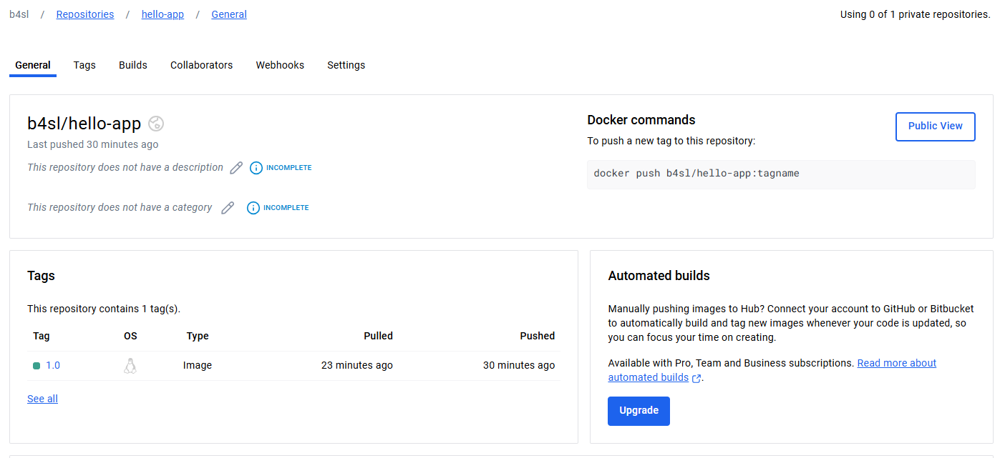


## Kuberenetes
Para el apartado de Kubernetes vamos a usar minikube, inicialmente vamos a tener dos archivos un deploy, que como su nombre lo dice hace un deploy de la imagen que acabamos de generar en el punto anterior, y un services que nos expone una ip para consumir el servicio 

### Procedimiento 

Inicialmente vamos a ejecutar un apply al deploy, seguidamente comprobamos el estado de pods y deployments con el comando **kubectl get all**

```bash
kubectl apply -f deployment.yml 
```

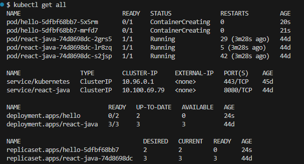

Seguidamente ejecutamos el apply al services con el siguiente comando 

```bash
 kubectl apply -f service.yml 
```

Por último ejecutamos el siguiente comando para ver la IP generada desde el Service tipo LoadBalancer

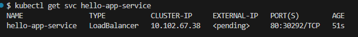

Por temas de que el minuke no puede exponer a internet como tal, procedemos a redirigir el trafico que se genera del loadbalancer al puerto 8080 de nuestro local, tomando el nombre del pod y ejecutando el siguiente comando


```bash
kubectl port-forward pod/hello-5dfbf68bb7-5x5rm 8080:8080
```

Cabe recalcar que para más comodidad para este tipo de ambientes locales, recomiendo utilizar el tipo Nodeport, y ya para un entorno de un cluster con host en nube si sería más viable utilizar un loadBalancer, estos mismos comandos son utilizados para un entorno de cluster en nube.


## Parte 4: CI/CD Pipeline con GitHub Actions

Para la configuración del pipeline se utilizó GitHub Actions, con un main que contiene el build de la imagen y su respectivo push al Docker Hub.

### Inicialmente tenemos 4 steps para los Jobs de build-and-push

1. En el primer step realizamos el login al Docker Hub, este login contiene unas variables secretas ya configuradas

    ```yml
    - name: Log in to Docker Hub
        uses: docker/login-action@v2
        with:
            username: ${{ secrets.DOCKERHUB_USERNAME }}
            password: ${{ secrets.DOCKERHUB_TOKEN }}
    ```

2. En el segundo Step tenemos el buil de la imagen
    ```yml
    - name: Build Docker Image
        run: |
            docker build -t ${{ secrets.DOCKERHUB_USERNAME }}/hello-app:1.0 ./Docker
    ```

3. En el tercer Step tenemos el push de la imagen

    ```yml
    - name: push Docker Image
        run: |
            docker push ${{ secrets.DOCKERHUB_USERNAME }}/hello-app:1.0
    ```
4. Para el cuarto step podemos hacer un test para ver que el contenedor ejecute correctamente


    ```yml
    - name: Test Docker Image
      run: |
        docker run --rm ${{ secrets.DOCKERHUB_USERNAME }}/hello-app:1.0 echo "Docker image is working"
    ```

    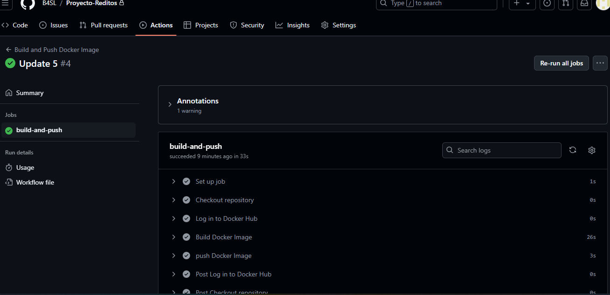


### Jobs despliegue Kubernetes

Para este apartado tenemos 3 Jobs

1. El primer Job realiza la conexión al cluster mediante un Kubeconfig, este archivo viene como tal de un secreto pre configurado 

    ```yml
    - name: Set up Kubeconfig
        uses: azure/setup-kubectl@v2
        with:
            kubeconfig: ${{ secrets.KUBECONFIG }} 
    ```

2. el segundo Job nos realiza el apply a los dos manifiestos
    ```yml
    - name: Apply Kubernetes Configurations
        run: |
            kubectl apply -f Kubernetes/deployment.yaml
            kubectl apply -f Kubernetes/service.yaml
    ```

3.  el tercer job valida como tal la configuración de los manifiestos:

    ```yml
    - name: Validate Kubernetes configuration
      run: |
        kubectl apply -f k8s/deployment.yaml --dry-run=client
        kubectl apply -f k8s/service.yaml --dry-run=client
    ```


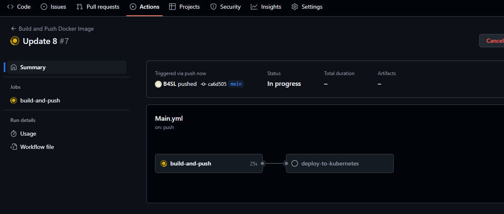